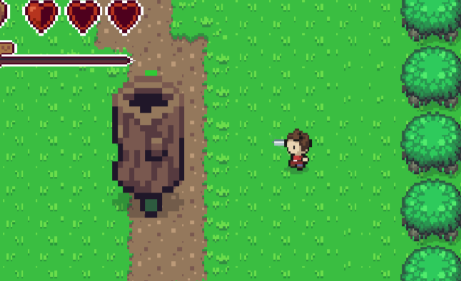

# RPG Game

 
## Overview

This game is a work in progress game that I decided to work on with no time limit. I want to finish this game when I have the chance so I will document the updates as I go.

## Features

* Key Features
    * Legend of Zelda -like fighting style
    * Currently 2 levels to explore

## How to Play

* **Movement:** WASD
* **Attack/Interact:** Spacebar

## License

Licensed under the [MIT License](LICENSE.txt)

## Contact

* Hyunjoonsur@gmail.com

## Acknowledgements

* [Mister Taft Creates](https://www.youtube.com/@MisterTaftCreates) for his goated tutorials
* [Cloud City Tileset](https://finalbossblues.itch.io/cloud-city-tileset)

## Issues

* Currently no game loop or finish

Report bugs and suggest features on the [Issues](https://github.com/samuelsurr/RPG/issues) page."

## Roadmap 

* Add more monsters
* Add more story
* Complete the gameloop with final boss
